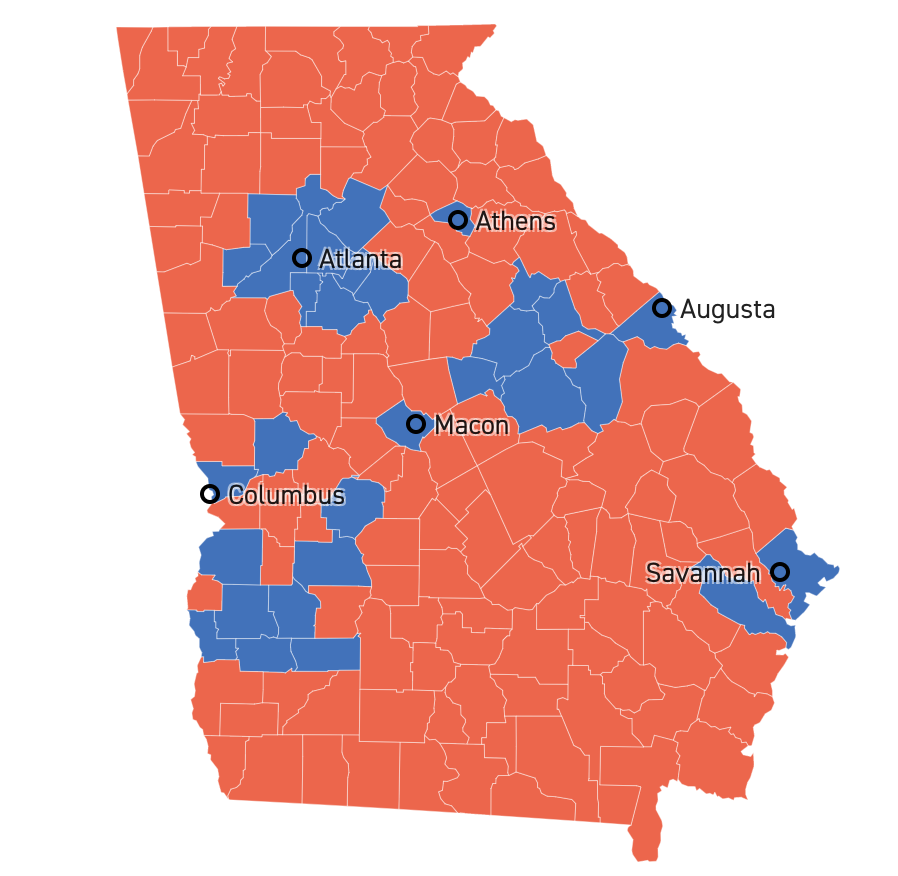

```{r setup, include=FALSE}
knitr::opts_chunk$set(echo = FALSE)
```

```{r libraries}
library(tidyverse)
library(lubridate)
library(openintro)
library(maps)
library(ggmap)
library(gplots)
#library(RColorBrewer)
library(sf)
library(ggthemes)
#library(usmap)
#library(plotly)
library(patchwork)
```

```{r data}
covid19 <- read.csv("https://raw.githubusercontent.com/nytimes/covid-19-data/master/us-counties.csv")

mask_data <- read.csv("https://raw.githubusercontent.com/kristinbryan/covid-19-data/master/mask-use/mask-use-by-county.csv")

census_pop_est_2018 <- read_csv("https://www.dropbox.com/s/6txwv3b4ng7pepe/us_census_2018_state_pop_est.csv?dl=1") %>% 
  separate(state, into = c("dot","state"), extra = "merge") %>% 
  select(-dot) %>% 
  mutate(state = str_to_lower(state))
```

# Welcome to our final!
# Analyzing the Relationship Between COVID-19 and Mask Use


## Research and Project Inspiration

In July, the New York Times published an article entitled [A Detailed Map of Who Is Wearing Masks in the U.S.](https://www.nytimes.com/interactive/2020/07/17/upshot/coronavirus-face-mask-map.html) The interactive map was informative regarding the presence of mask-wearing across the United States. To create this map, columnists Josh Katz, Margot Sanger-Katz and Kevin Quealy analyzed information from the County-level Data for Mask Use in the United States. This dataset, paired with the COVID-19 data we've been using in our class throughout the module, allowed us to assess the relationship between mask-wearing and COVID cases across the country. Specifically, are states where mask-wearing is greater, are COVID cases lower?


```{r}
covid_data <- covid19 %>% 
  left_join(mask_data, 
            by = c("fips" = "COUNTYFP"))
```
<!-- >>>>>>> 875c8c0bdef9e9e5c9b9968876ffe336007874f5 -->

## COVID-19 Map

In order to  find the correlation between total COVID-19 cases and mask wearing, we created two individual maps for each to display the COVID-19 data and mask data in each state. 

```{r}
states_map = map_data("state")

covid_map <- covid_data %>%
  filter(date == max(date)) %>%
  mutate(state = str_to_lower(state)) %>%
  left_join(census_pop_est_2018,
            by = "state") %>%
  group_by(state) %>%
  mutate(case_rate = sum(cases)/est_pop_2018) %>%
  ggplot(aes(fill = case_rate)) +
  geom_map(aes(map_id = state),
           map = states_map) +
  labs(title = "Current COVID-19 Cases", fill = "% Infected") +
  expand_limits(x = states_map$long, y = states_map$lat) +
  theme_map()

covid_map
```

## Mask Map

To find out how often people in the US were wearing masks, we created a map to display mask use. This map shows the percentage of people who always wear masks when leaving the house.  

```{r}
county_map = map_data("county") %>% 
  dplyr::rename(state = region, region = subregion)

mask_map <- covid_data %>% 
  mutate(county = str_to_lower(county)) %>% 
  drop_na() %>% 
  ggplot(aes(fill = ALWAYS)) + 
  geom_map(aes(map_id = county),
           map = county_map) + 
  labs(title = "Mask Use in each US County", fill = "% of Mask Use") +
  expand_limits(x = county_map$long, y = county_map$lat) + 
  theme_map()

mask_map
```

Our mask data shows the frequency of mask wearing in each state. The New York Times article analyzed the map and determined that mask use is high in the Northeast and the West, and lower in the Plains and parts of the South. The article also focused on differences on the local level. For instance, mask wearing is high in Washington, D.C, but in rural subsets of Maryland and Virginia, norms seem to differ. The columnists found that generally in urban areas, mask wearing was more common. 

However, the New York Times also reported that mask-wearing in the U.S was relatively high. This could be because they conducted a self reported survey. The survey asked: "how often do you wear a mask in public when you expect to be within 6ft of another person?" The options were: "always, frequently, sometimes, rarely, and never." On average, around 80% of Americans report mask use either "always" or "frequently" in public within 6ft of others. 

The article further stressed the implications of a national mask wearing mandate. The columnists maintain that it would be difficult to achieve such a thing. However, research suggests that mandates are effective. For example, implementation of laws  with increasing the use of seatbelts and the vaccination rates among school-aged children. Laws may be helpful to decrease health risk and improve overall percentages.


## Masks vs. COVID-19

So what is the relationship between mask wearing and COVID-19 infection? When we view our maps side by side, we observe patterns between the two. 

```{r, width = 200}
(covid_map | mask_map) + plot_annotation(title = "COVID-19 vs. Masks")
```

When looking at these maps, we can observe the correlation between mask use and COVID-19 case rates. From the maps, there appears to be an inverse relationship between mask use and cases. For example, North Dakota has the highest rate of COVID-19 infection, and many counties report limited mask use. In California, there are fewer cases and a greater frequency of mask use. 

Katz, Sanger-Katz, and Quealy also illustrated that mask use is often a partisan issue politically. President Trump and other Republican officials have downplayed the necessity of mask-wearing, and expressed negative reactions to a national mandate. The survey shows that Republicans are generally less likely to wear masks, despite self-reports being high among Americans. Partisanship, it turns out, is the biggest indicator of mask-wearing likelihood, not age or where you live, or other variables, according to the article.

Rather than political party, and by county, we wanted to determine the relationship between mask-wearing and COVID cases at the state level. 

## Let's Take a Closer Look

In order to analyze the relationship between mask use and COVID-19 spread, we took a closer look at Georgia to see how the two compared on the county level.

```{r}
county_map = map_data("county") %>% 
  dplyr::rename(state = region, region = subregion) %>% 
  filter(state == "georgia")

georgia_cases <- covid_data %>% 
  filter(state == "Georgia") %>% 
  mutate(county = str_to_lower(county), 
         county = ifelse(county == "dekalb", "de kalb", county)) %>% 
  group_by(county) %>% 
  filter(date == max(date)) %>% 
  ggplot(aes(fill = cases)) + 
  geom_map(aes(map_id = county), 
           map = county_map) + 
  labs(title = "Cases per County", fill = "Cases") +
  expand_limits(x = county_map$long, y = county_map$lat) + 
  theme_map()
```

```{r}
county_map = map_data("county") %>% 
  dplyr::rename(state = region, region = subregion) %>% 
  filter(state == "georgia")

georgia_masks <- covid_data %>% 
  filter(state == "Georgia") %>% 
  mutate(county = str_to_lower(county), 
         county = ifelse(county == "dekalb", "de kalb", county)) %>% 
  group_by(county) %>% 
  filter(date == max(date)) %>% 
  ggplot(aes(fill = ALWAYS)) + 
  geom_map(aes(map_id = county), 
           map = county_map) + 
  labs(title = "% Mask Use per County", fill = "") +
  expand_limits(x = county_map$long, y = county_map$lat) + 
  theme_map()

```

```{r}
(georgia_cases | georgia_masks) + 
  plot_annotation(title = "COVID-19 vs. Masks in Georgia")
```

In Georgia, it's harder to find a correlation between mask use and COVID-19 cases that is consistent with our data on the state level. For example, Atlanta has a relatively high percentage of mask use but still has high rates of infection. One explanation for this could be the size of the city. Because Atlanta is more densely populated than rural areas, it makes sense that there is a higher number of cases simply because there are more people. 

# Politics in Georgia: Stacey Abrams & the 2020 Election - what does this mean in terms of our data?
Source: [Stacey Abrams Profile](https://apnews.com/article/election-2020-joe-biden-stacey-abrams-georgia-atlanta-1d265f35303be8ca59836a1a95018d82), [NYT Article](https://www.nytimes.com/interactive/2020/07/17/upshot/coronavirus-face-mask-map.html), [Georgia 2020 Presidential Election Results- via Politico](https://www.politico.com/2020-election/results/georgia/)

Source: [Stacey Abrams Profile](https://apnews.com/article/election-2020-joe-biden-stacey-abrams-georgia-atlanta-1d265f35303be8ca59836a1a95018d82)


While considering Georgia's COVID cases & mask wearing likelihood, our group thought about the outcome of the 2020 presidential election. The NYT article clarified that political affiliation was the greatest predictor of mask-wearing probability across the board. Georgia has been solidly "red" since 1972 (with the exception of Jimmy Carter in '76 and '80, and Bill Clinton in '92). However, it's important to note that Georgia has a history of suppressing Black voters, a demographic that has voted solidly Democratic throughout American history. However, for the first time in nearly three decades, a Democratic president-elect is set to carry Georgia into the next term. This can be credited to Stacey Abrams, one-time governor candidate in Georgia and a nationwide voice on voting rights. Abrams raised millions of dollars to help register hundreds of thousands of new voters, which inevitably turned Georgia blue in 2020. 


Georigia Election Results 2020- via politico https://www.politico.com/2020-election/results/georgia/

Urban areas like Atlanta and Columbus voted overwhelmingly blue in 2020. Abrams facilitated an uptake in voter registration and turnout in these places, which are also among areas in Georgia where mask-wearing is highest. Cases in Atlanta are also roughly around 40,000, the most cases statewide. However, with a population of nearly 500,000, this can be expected. Additionally, in rural areas, there is not necessarily more cases than in Atlanta, but residents are less likely to wear a mask. Generally, residents also voted Republican in these areas. For example, Dade county has approximately 10,000 cases, but there is a 7% chance an individual will be masked in public, and voted about 80% in favor of Trump over Biden (20%). This almost completely contrasts with urban counties in Atlanta: pro-biden, more cases, and far greater mask-wearing likelihood. It is interesting to consider Abrams' role in registering voters in Georgia that helped flip the state in 2020, and how those voting demographics correspond to the NYT mask wearing data, and the dataset exploring COVID cases nationwide. It appears as though the assertion that political affiliation corresponds to mask wearing remains true in Georgia.

# Conclusion

Our group concluded that there is evidence to suggest that mask wearing is an effective precaution to take when it comes to protecting others and yourself from COVID-19. We also found that certain underlying variables, such as political affiliation, population density, and city vs. country surroundings factored into the relationship between mask-use and COVID cases. As seen with Atlanta, Georgia, COVID cases were comparatively higher than surrounding counties, as was mask-wearing probability. This goes against our original thought process: higher mask use did not necessarily mean less COVID cases. However, we maintain that this trend is attributed to population density rather than the effectiveness of mask-wearing. It makes sense that a bustling metropolitan area of 500,000 people has more cases than less densely populated areas. For instance, Dade county has about 16,000 people. While our initial thought process diverted slightly as our project progressed, it's clear that the relationship between mask wearing and COVID in the United States is strictly correlated in several respects. 

<!-- >>>>>>> 875c8c0bdef9e9e5c9b9968876ffe336007874f5 -->
<!-- >>>>>>> f615ca4fe7f735bf9f293f89b1d3d4e392070fc9 -->
